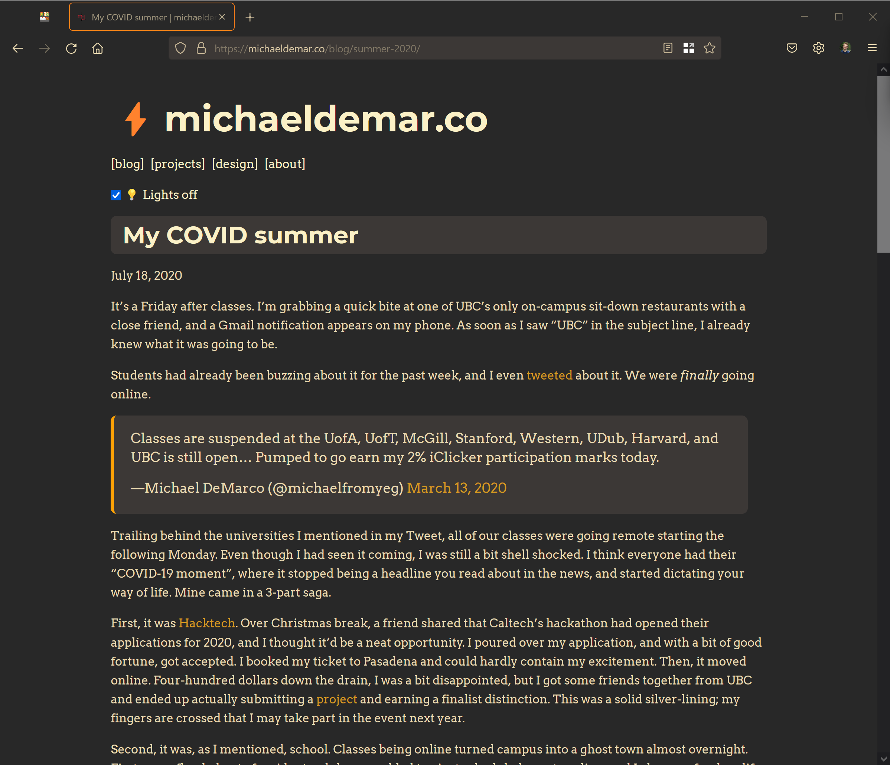

# michaeldemar.co 👋🏠

[](https://michaeldemar.co) [](https://michaeldemar.co)

My personal website built using Gatsby (with React) and SCSS. Contains a blog, a graphic design portfolio, write-ups about my personal projects, and a bit about me :-)

## Development

There's just a couple of dependencies to install before running this project locally.

-   [Node.js](https://nodejs.org/en/) and preferably [nvm](https://github.com/nvm-sh/nvm)
-   [gatsby-cli](https://gatsbyjs.com/docs/reference/gatsby-cli/#how-to-use-gatsby-cli)

If you're on macOS, Linux, or WSL:

```shellscript
# Install Homebrew (or Linuxbrew) if you haven't already!
brew install node nvm
npm i -g gatsby-cli
```

After cloning the repository, run

```shellscript
$ nvm use
$ yarn install
> (unfortunately, many dependency warnings...)
$ yarn start
> You can now view michaeldemar.co in the browser.

    http://localhost:8000/

    View GraphiQL, an in-browser IDE, to explore your site's data and schema

    http://localhost:8000/___graphql

    Note that the development build is not optimized.
    To create a production build, use gatsby build
```

If you're looking to publish your Gatsby site to GitHub pages after forking this project, see the [Gatsby documentation](https://gatsbyjs.org/docs/how-gatsby-works-with-github-pages/) for more information. If you're interested in helping me turn this project into a re-usable Gatsby template, feel free to open an issue or PR.

## Notes

Anything I think is helpful to know for future me I'll leave here!

### The `static/` folder

The static folder contains files that are "directly" copied (i.e., they are unmodified during copying) to the `public/` folder. [You should avoid using it!](https://gatsbyjs.com/docs/how-to/images-and-media/static-folder/)

It's fine for the `favicon.ico` and `robots.txt` files to live here. The `CNAME` doesn't have to live here; GitHub Pages will pick it up from the project root.

## Screenshots

Here's a few screenshots of the site (...though it often changes).




## Contributing

See a typo or some other improvement? Feel free to open an issue or PR. Thanks in advance!
