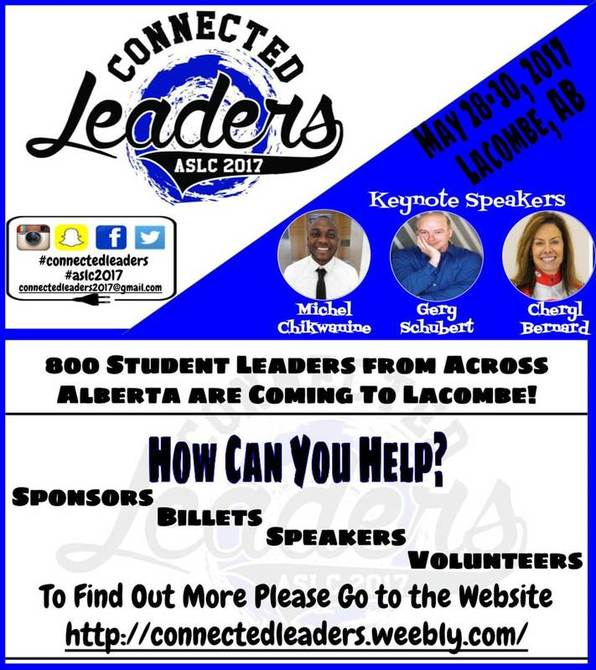
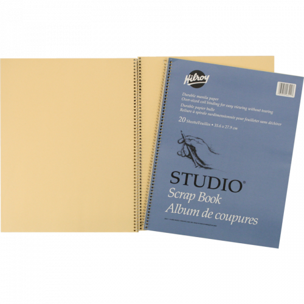
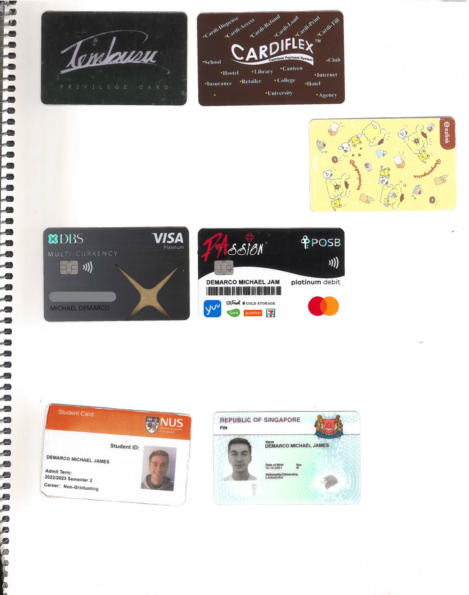
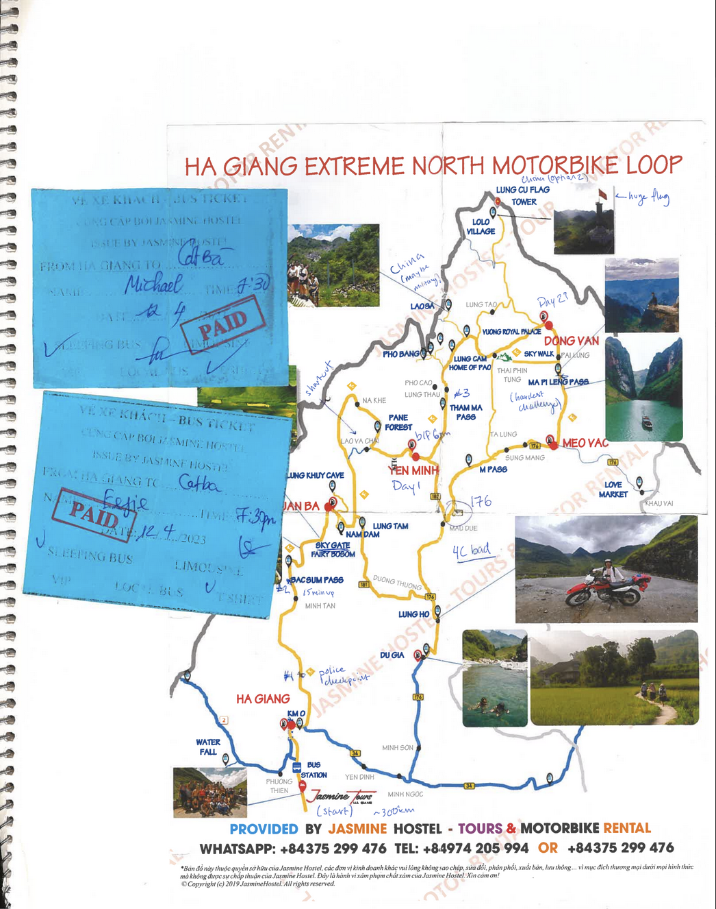
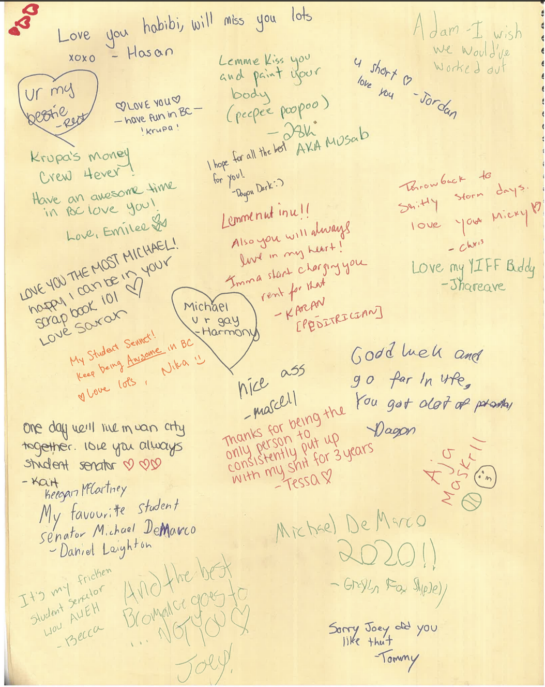
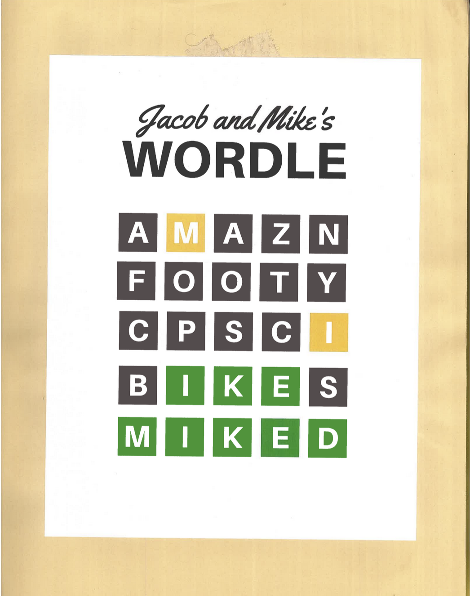
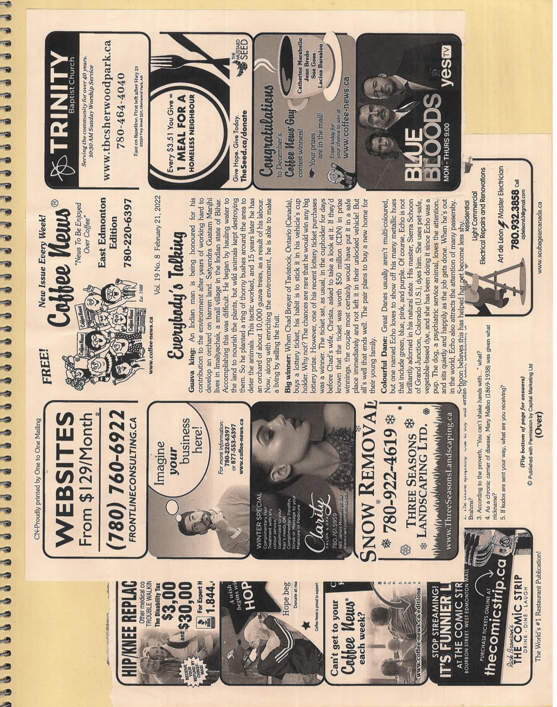

> This post is also available on my Notion site, [here](https://michaelfromyeg.notion.site/a-decade-of-scrap-booking).

In my first year of high school, I had the luxury of spending an all-inclusive weekend in Lacombe, Alberta. In case you’re not familiar, Lacombe is a city in central Alberta, 125 kilometers south of Edmonton and home of the Len Thompson Manufacturing Plant (that part, of course, you already knew). In 2017, it was home to the Alberta Student Leadership Conference. The website is still up, [here](https://connectedleaders.weebly.com/).

I went, starry eyed, to learn how to lead. And learn I did! (My whole leadership experience in high school would be a blog post on its own.) I attended countless workshops, keynotes, and lunches. And what did I get at each of them? (Besides, you know, leadership skills.) Paper. In some form or another: pamphlets, brochures, photos, postcards, name tags, bookmarks. You name it, I got one.

Coming home, I was faced with a serious dilemma. How was I going to possibly save all of this essential learning material? My printed-out-Polaroids? Or further still, my conference badge?! My mother (as always) had the solution.

The Hilroy Studio® Scrap Book.

This series of twenty manila pages, coil-bound and enveloped in a firm blue cover has served as the springboard for a decade of creative cataloging. My now fourteen-book long series is a living memoir that has served as a window into my past (translated into two-dimensional form). A collection featuring romantic letters and nasty break-ups, acceptance letters and untimely rejections, postcards from around the planet and receipts from my local liquor store. It’s got everything.

After occupying a corner of my bedroom for the past year, I recently sent them home to Edmonton (as I moved to San Francisco, to begin New Grad Life). I packed them up and shipped them off to the Great White North. However, while on a mini graduation trip in Tofino, British Columbia, my mom remarked that while one of the two boxes I sent home had arrived, the other was nowhere to be found. And of course, the missing box was the one with the scrapbooks.

For a short time, I was devastated. An entire decade of hand-picked, cherished collectibles had ostensibly been whisked away. Up until that point, I had never bothered to reflect on how much the cathartic cutting-and-pasting meant to me. It was just a sort-of offbeat hobby, a way to make sense of all the random Things that showed up in my pockets in my day-to-day life.

Thankfully, the scrapbooks did turn up only a handful of days later. The near-miss pushed me to think about how much this hobby had taught me about myself. And now, on the roughly ten year anniversary of the hobby, it’s time to finally share those reflections, and some of my favourite pages from along the way.

First, I should share my Rules of The Scrap.

1. Err on the side of keeping it
    1. Leaving a table at a restaurant? Scoop up the receipt. Have some miscellaneous paper in your pockets after a night out? Save it. Dump it all in a bin for later processing. I often find the most insignificant pieces (e.g., a receipt), to serve as the best starting point for a story (e.g., “remember how laughably bad the service was?”).
2. Make it real, not ‘nice’
    1. Let’s be honest: life is often ugly and occasionally beautiful, and my scrapbook reflects that. ‘Scrap’ means discarded, leftovers—not fancy gel pens and cursive writing. It’s not Instagram-ified (i.e., limited to the top 1% of all my best memories), but rather a depiction of my whole self.
3. The opening is dedicated to travel, and the last to former-selves
    1. Travel makes life long and special, so for me it appears first-and-foremost—boarding passes, bus tickets, luggage tags, and more adorn the opening page.
    2. I also *usually* dedicate the last page to pieces of ID I no longer use, as a kind of goodbye to a phase of life.

Expanding on 3(b), here is, for example, the last page of scrapbook #9, featuring Michael the Singaporean Exchange Student.

Featuring my ‘Tembusu Privilege Card’ (though after being a guest [there](https://tembusu.nus.edu.sg/), the real privilege was mine), my Cardiflex (which, like any card for a printer, never worked), my bus pass, debit cards from the world’s most annoying bank, my student ID, and my foreign ID (featuring a rather rough passport photo taken after a nearly 20 hour flight).

All once mainstays in my wallet, now at rest in scrapbook #9.

I’ll amass content over about a one to three month period, and then spend an afternoon sorting the content. I rip out the interesting bits and pieces, and paste them in haphazardly. (Usually I’ll toss on a movie in the background. Since you got here, [you should follow me on Letterboxd](https://letterboxd.com/michaelfromyeg/)!)

For me, the activity of making the scrap books is as significant as the scrap books themselves. (Forgive me, but I'm going to be a bit philosophical here.) We Humans (—capital ‘H’) toil away on the ol' Blue Marble. Purpose is something which we actively breathe into life. Those things which I scrap book—remnants from events, letters from relationships, receipts from dinners, and raffle tickets from the nights out—are, for me, little microcosms of our Purpose (—capital ‘P’) here. Life must be lived! Piecing together the scrap books makes me appreciate the insanity and innate wonder of our existence here—all The Good, The Bad, and The Ugly.

Soapboxing aside—here are some of my favorite pages from each, with some stories.

**Scrapbook #12**

From my trip to Vietnam, circa April 2023.

The Ha Giang loop is probably some of the best travel you can do today. This is the route I took on the three day trip through north Vietnam.

The loop is so much more than getting on a motorbike and pressing the gas. It's the mishmash of people, the party, and the drivers themselves.

Hell, my driver (Thanh, pronounced 'Tyne,' which, to my amusement, is the real name of one of my other good friends) at just merely 26 years of age had four children. He had an inkling for YouTube trap-house mash-ups, and was astounded that a thing such as a [Big Booty Mix 22](https://youtube.com/watch?v=sm3bt4Q39b8) exists.

**Scrapbook #1**

There have been very few times I've written in, or allowed writing in the scrap books. One exception was my last day of high school. These people all mean a lot to me, despite the fact that I've seen a whopping ~4 of them consistently over the past 5 or so years.

Life moves fast; this page is a grounding reminder that the people in your circle can change immediately, without warning. A reminder to call your friends and let them know they’re loved, however you express that.

(Also, we should take a moment appreciate the absurdity in the top middle of the page, and the purported run for Prime Minister implied by 'Michael DeMarco 2020!!' in the bottom right—I'll take the votes.)

One more here: the 'Sorry Joey did you like that' was from prom. My best friend in high school, Jordan, and I campaigned for Best Bromance. In his best Steve Harvey impression, my friend announced it was uh—oh—I misread the names—and just like that we lost. Can't win them all!

**Scrapbook #6**

Me, as a game of Wordle. If you had to guess where this was used, what would you go for first? Maybe a residence hall event? Perhaps some other club social?

How about a fraternity party?

Twice annually, I had the privilege of getting to decorate my room in some absurd theme courtesy of Phi Gamma Delta a.k.a. Fiji's 'Small Rooms' function. In the spring of 2021, Wordle was all the rage, and thus my friend Jacob and I Wordle-ified his room. I actually created a custom version of Wordle for our room ('Fijidle'), which eventually got DMCA'd by the New York Times for copyright infringement. [Yeah](https://npr.org/2024/03/13/1238142507/cease-desist-new-york-times-wordle-spin-offs).

**Scrapbook #14**

Last but not least, I'd be remiss if I didn't give a shout-out to the Coffee News. This is—seriously—one of the things I miss most from Alberta. It's a two-page spread featuring four off-the-wall or otherwise 'neat' news stories, quotes, a bit of trivia, Horoscopes, jokes, and a game to search for a drawing of a little man among the ad space.

I guess my mom picked up on how much I enjoy the weekly editions, so has now begun stockpiling them, and mailing them out to wherever I happen to be on a monthly cadence. Thanks, mom.

---

Those are just a few cherry-picked highlights, but there's of course much more story to tell. So where do I go from here?

I’m tinkering with ways for friends to join on the story. I want to create something like a series of [FigJam](https://figma.com/figjam/) boards with collaborative "sticky-noting" of things that stick out to people. I do need to redact some of the content that’s a bit *too* personal, but I think there's a cool, collaborative happy medium here.

Ideas? Questions? Concerns? For the first two, feel free to write me at michaelfromyeg [at] gmail [dot] com; for the third, I'm not quite sure I care, so don't.
