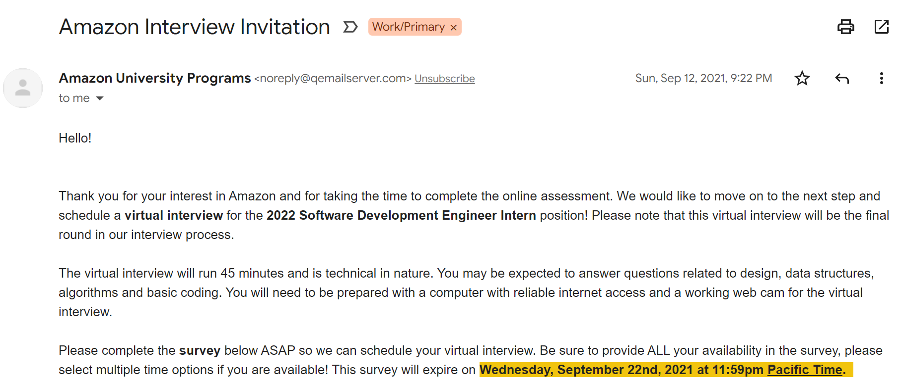
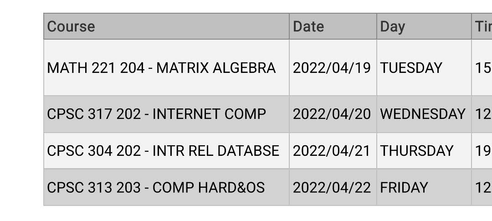

It's been about two weeks since I wrapped up my position as a Software Development Engineer (SDE) Intern at Amazon, and I wanted to reflect on my time there this summer. I often get asked about the full end-to-end experience of my time at Amazon, so before I get into what I worked on and what I learned, I'll first do a full re-wind to my initial application.

## Working towards a FAANG offer

In recruiting for my third co-op term at UBC, I laid out definitive guidelines for the kind of position I was after. My primary objective was to work at a company solving complex, 'technically engaging' problems, to grow quickly as an early-career engineer. In addition to at-work complexity, I was also very interested in moving to a new city in Canada or the US, to grow personally and get a chance to travel to new places.

I applied to Amazon in early August as soon as their applications opened. (For those of you currently recruiting, this is often an overlooked but highly important factor; big companies often recruit on a "rolling-basis," meaning an early application is critical.) I chose Toronto largely on a whim.

I then completed two online assessments (OAs). The first was a fairly standard set of technical questions on HackerRank, and the second was a "work simulation" to assess behavioural skills asynchronously. I fortunately passed, and then scheduled a final-round 45-minute technical interview. The interview was also fairly standard; it consisted of technical and behavioural questions. Unique to Amazon, the behaviourals are focused on a set of [leadership principles](https://amazon.jobs/en/principles) (LPs) that, I can now attest, are embedded throughout company culture. I'll touch more on the LPs later.

## Getting settled in Toronto

Moving to Toronto was a rather involved experience. Immediately after wrapping up one of my most brutal final exam schedules to date, I had to pack, donate, or dump my items from BC that I had nested during the pandemic. (It was... a lot of stuff.) Then I was busy with Amazon's pre-onboarding while also recruiting for Fall 2022 internships. (That's a whole [other story](https://michaeldemar.co/blog/rescind-playbook).)

I boarded my flight and was off to Toronto. As an Edmonton native, Toronto was rather overwhelming. The city is gigantic and there is always something bustling. It truly is a "concrete jungle," especially when you're working in the heart of downtown, situated right between the CN Tower and Scotiabank Arena.

Thankfully, I was able to take full advantage of what the city has to offer. And with weekend trips to Montreal, Niagara, and Muskoka, there was no shortage of nearby entertainment throughout my three-and-a-half months in the city.

## From big tech to Bigger tech

The next major adjustment for me came in navigating life at a huge company. Make no mistake: Samsung, where I previously interned, is also large. However, there is something truly unique about "Amazon-scale." When your intern class is nearly 15,000 folks, things will assuredly feel a bit different.

Thankfully, I had an awesome team and intern class around me to support me throughout the onboarding process. Amazon's onboarding, while extensive, is also exhaustive, leaving you with a full set of tools and knowledge to thrive in your time there. My initial nerves were replaced by excitement, and I dove head-first into our tech stack.

I got onboarded to my project relatively quickly. Within the Supply Chain Optimization Technologies (SCOT) organization, I had the chance to work on a "product tour." (Here's [an article](https://blog.asana.com/2018/10/move-fast-without-technical-debt-product-tours-react) from a former Asana intern about an analogous project for their core application.) It was built on top of a complex, multipage booking portal that used React. While I didn't anticipate being placed on a frontend project, I enjoyed it far more than I thought I would, and I learned a ton about today's challenges in scaling modern frontend technologies. (I'm even following this experience up by giving a React workshop at this year's [Hack The North](https://hackthenorth.com) in Waterloo—make sure to tune in.)

## Six lessons from the six

It was rare I had a day at work without some new learning or takeaway. Here are six of my highlights.

### Lesson #1: There are no bad questions

While I had a decent chunk of relevant React experience to leverage for my project, our application was still complex and tens of thousands of lines of code long. To navigate the tricky waters that come with being an intern in engineering, questions are your lifeline. I was able to on-board to our project right away by scheduling impactful one-on-ones and remaining curious about our project's anatomy.

Personally, my Achilles' heel as an engineer is getting bogged down by particularly challenging problems (and there are no shortage of those at Amazon). Asking questions turned out to be a fantastic shortcut for getting to the heart of an issue.

### Lesson #2: Complexity is evil

There is one special question you can ask: "why?" Asking the right "why?" can help determine what exactly is desired by your end-user (or "customer," in Amazon terms) and minimize feature bloat. In particular, I had chats with PMs from separate teams (...in entirely different continents), so finding cohesion in product vision and preventing unneeded complexity required careful question-asking.

(As any good [Grug-brain developer](https://grugbrain.dev) knows, complexity is an existential threat, so it should be eliminated at all costs!)

### Lesson #3: Agility is your friend

Something interesting about the project I worked on was that it was actually a continuation of a former intern project. Often, Amazon interns complete a design phase for their project, scoping out the minimum viable feature set for an initial release before jumping into implementation.

From nearly my first day, I was working on delivering an already-scoped design. I love getting hands-on, but quickly found myself in a cobweb of only partially ready code. I didn't take enough time to understand and revise the existing timeline, which left me trying to ship many features at once.
This led to large code changes that were difficult to test and debug.

Instead, try to be as lean as possible in your code. Small commits, small pull requests, and minimally scoped changes make it easy to bisect changes when things, inevitably, go wrong. Also: any refactoring work must be completed prior to shipping new features.

### Lesson #4: Community is key

It takes a village to raise a child, and it also takes a village to raise an intern. It's critical to develop open communication lines between yourself and your "support network" on the job. At Amazon, this consisted of my mentor, manager, my manager's manager, and the most senior engineer on my team. Scheduling regular one-on-ones and documenting the discussions levelled up my experience tremendously.

The idea of community goes beyond your team as well. It's also essential to immerse yourself in activities with your fellow interns and the broader city you live in as well.

### Lesson #5: Culture isn't just buzzwords

Amazon's leadership principles (LPs) are embedded into the DNA of the company. My co-workers would constantly leverage the LPs to guide hard decisions or steer meetings in the right direction. Beyond being the backbone of Amazon's culture, the LPs are also just brimmed with great life advice. As a former leadership student in high school, I had a lot of fun trying to embed ideas like "Ownership," "Invent and Simplify" and "Learn and Be Curious" into my day-to-day at Amazon.

### Lesson #6: Have fun

It's easy to get wrapped up in work and find yourself constantly worrying about return offers, your next internship, and the various other stressors of everyday life. Kick back with your co-workers when the chance arises and make the most of your internship. To help center myself, I would often reflect on where I came from to end up at Amazon. This kind of mindfulness exercise helped me make the most of my time at Amazon.

## So... what's next?

While I could not be more grateful for my time at Amazon, I also could not be more excited for what this next year has in store. I have a chance this August to rest and reconnect with family before I join Tesla this fall on the Supercharging team. I'll also be serving as an Undergraduate Teaching Assistant (UTA) for my first-ever 300-level course; namely, "Internet Computing" (CPSC 317) at UBC with Professor Alan Wagner.

Questions? Comments? Don't hesitate to reach out at [mdemar01@student.ubc.ca](mailto:mdemar01@student.ubc.ca).

Thanks for reading!
