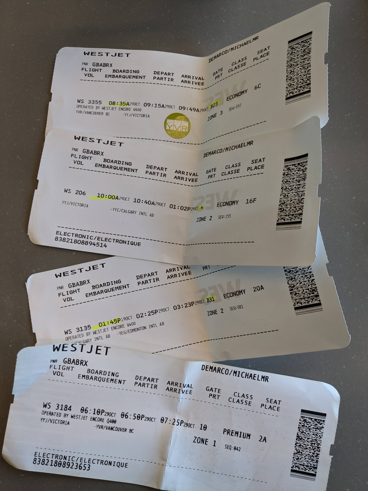
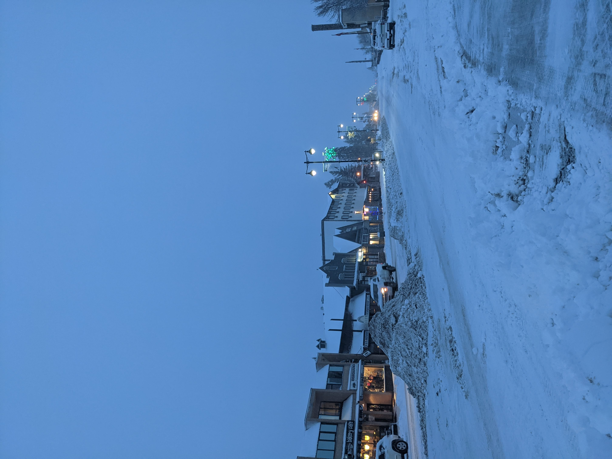

Story time. I'm bad at flying.

But I don't mean the act of flying, as a pilot. I mean as a passenger.

How can you be bad at packing your bags, going to the airport, filing through security, and hopping on a plane? Great question! I'm not sure, but after reading this, I think you'll be inclined to agree.

Right now, I'm sitting in the Victoria airport after trying to board a short-haul flight to my hometown of Edmonton, having it cancelled and rebooked (instead through a three-way connection from Vancouver-Victoria-Calgary-Edmonton), then _illegally_ boarding my first flight with an expired license, only to get flagged in Victoria. That's right. I'm now stranded in YYJ all because I wanted to watch some Heritage Classic hockey. And for turning 22.

This morning was hell from start to finish. I woke up with a blistering hangover at the crack of dawn. The past night I'd spent Hall-o-weekend-ing and was now going to head to Edmonton to catch the Heritage Classic. It was the Battle of Alberta, and the first outdoor game in Edmonton in 20+ years. I convinced my whole family to go. I was elated! Upon arriving at the airport, however, I saw my flight was cancelled. I waited in a brutally long line of folks getting other flights sorted (including, but not limited to, some aspirant vacationers pleading to make it to Puerto Vallarta and a few Calgarians who faced a different, but similar cancellation—in that case, WestJet's probably doing them a favor by keeping them in Vancouver). It was only while waiting in this roughly hour-long line that I began to really feel the effects of running a half-marathon and clubbing the day prior. I was seething in pain, literally clutching one of the hand rails just desperate to take a nap on _some_ plane going _some_where.

I finally got to the front, and the gate agent was friendly and understanding. "You going to the game?" I gave him a nod and he gave me one of the most ridiculous itineraries I've ever seen in return. First to Victoria, then to Calgary, _then_ to Edmonton, just in time for the 5pm puck drop. I had 20 minutes to make it to the gate, so I flew through security (with a bit of WestJet-endorsed line-cutting) and made it no problem. I boarded my flight with ease and had a smooth trip. What else could go wrong!

Lots. My connection from Victoria to Calgary got delayed, but not so much that I would miss my Edmonton connection. Annoying, but not an ordeal. I paid for a $22 breakfast sandwich, and finally started to fight off the hangover. I went to board the flight around 11am and the gate agent stopped me dead in my tracks. My license is expired?! There's no way! I _just_ **flew** here.

I turned 22 on October 15th, 2023, and indeed, that's the day my license expired. Mind you I had bought alcohol, been to the club, and _boarded an aircraft_ with this identification. If I had had another piece of non-photo identification, I might've been able to board, but my other documents were with my passport at home. Boohoo. Back to Vancouver I go! Sheepishly, I messaged my family and transferred my mom the ticket.

This is where it gets better. When the gate agent told me I couldn't go, I wasn't that phased. **This isn't the first time my license has gotten me into plane-boarding trouble.**

Story time, again. Back in high school, I didn't get my license. So, during the summer after my freshman year, I did lessons with the Alberta Motor Association and was geared up for the exam. The only problem was the pandemic put a pause on the actual examinations. I had to write it in December, instead, when I was home for winter break.

No problem, I figured. I took the exam on the second last day of my trip home and passed with ease. I headed into the DMV to process the paperwork, and coincidentally was wearing my UBC hoodie. The DMV agent smartly asked if I'd need my license to fly back to Vancouver. After some discussion, we (that is, myself, the agent, and my mother, a.k.a., _my_ agent) agreed that the temporary one was fine. Why?!? I had no idea! That obviously makes no sense. But we all agreed.

So, when I got to the airport, I obviously wasn't let on. However, I needed to be back in Vancouver as soon as physically possible. I was scheduled to start my first-ever co-op gig with Samsung. I looked at flights and… $#!T! Everything was unbelievably expensive or booked out.

I explored all other options. Bussing? No dice. How about… a train? The VIA Rail economy ticket wasn't too expensive (~$150 if I recall correctly). Done. Booked.

And with that, I rode The Canadian from Edmonton to Vancouver in early January. The trip itself was stunning, with unbelievably gorgeous views of the Western Canada in wintertime. It was a bit eerie though, as the crowd on the train looked very no-fly-list-y. One dude in got kicked off in Northern British Columbia for using drugs in the washroom.

The other train ordeal was a massive blizzard that passed through the interior during the train travel. It knocked down a litany of trees, all over the tracks. This meant we would ride for twenty or thirty minutes, stop, clear the tracks, and go again. In the middle of nowhere! My mom had packed me peanut butter sandwiches for the train trip, and I had to start _rationing_ them. I killed time by trying to write unit tests for APK file extraction (…I was on the Knox team at Samsung). Not the most riveting stuff, I'll confess. Eventually, after nearly a complete **twenty-four-hour** delay, I made it back to Vancouver.

You would've thought that experience had taught me to carry my godforsaken passport, but evidently my hungover morning self was not exactly envisioning this exact scenario.

Fool me once, fool me twice. [And I'll probably make a fool of myself again](https://youtube.com/watch?v=aqGn-1XX7cI).
