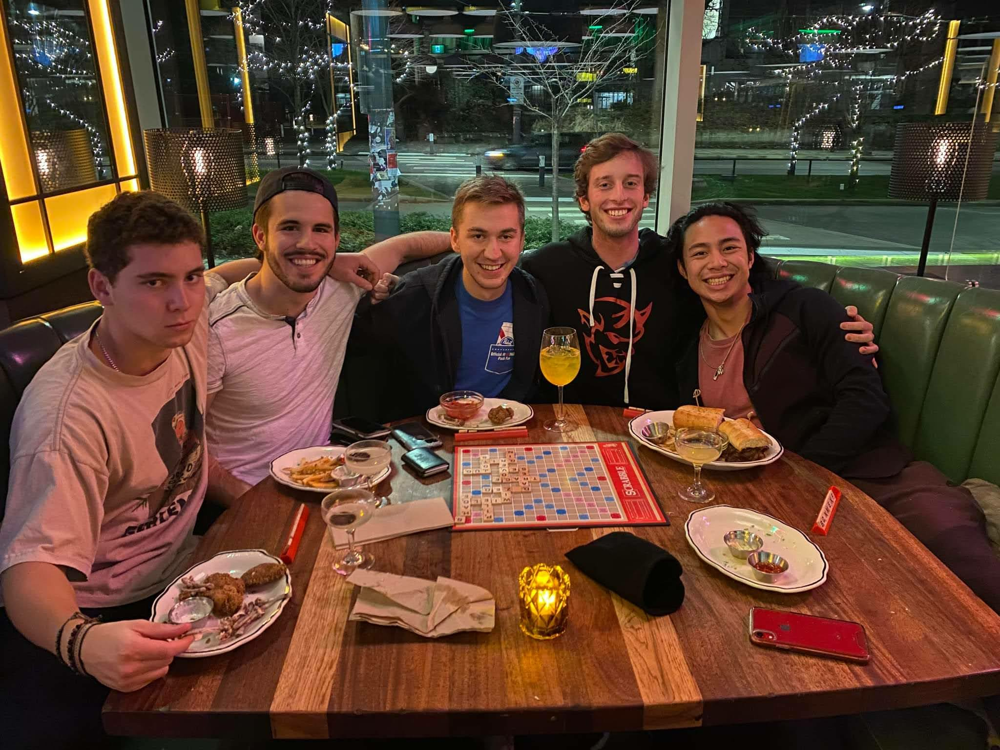
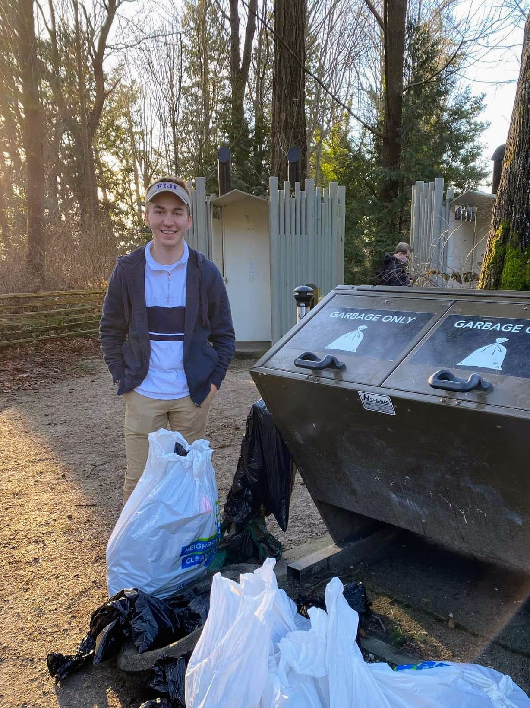

Every single day, you start out as an empty cup.

Humbling, right?

Beyond your laundry list of personal to-dos, slog of tasks at work, and mountain of messages to which you need to respond, you actually need to focus on just one thing each day. And that's filling your cup.

## The inspiration

I came across an idea loosely linked to this end product from YouTuber [Ali Abdaal](https://youtube.com/c/aliabdaal). His rather simple, but genius suggestion was to mark a highlight each and every day of your life. "Mark" can look differently depending on your routine; my weapon of choice is inscribing an "H" beside an item from my bullet journal. In some way, though, you should be tracking your highlights for easy reflection.

Having a "highlight" each day doesn't mean spending every day at a concert, or a sports game, or at the hottest club. Rather, it's something that brings you a bit of needed warmth when life's natural chaos ensues. It can be as simple as a great meal, a brisk walk, or a quick phone call. They're moments that you'd want to capture and put in jar for safe-keeping, but often a quick photo will have to do.

## The idea

And those highlight moments help "fill your cup." (The "highlight" idea for me is a bit plain, but I think a visual analogy gets it across better. Maybe that's my inner-teacher speaking.)

Not all cups are created equally, either. After a particularly stressful day or week, I find my cup becomes more of a vat. Other times, I'm a bit more of a teaspoon. Being aware of this ebb and flow though has proven to be a particularly powerful idea when it comes to managing my mental health.

With the pandemic, we had a bit of a drought. It was hard to stumble across cup-filling-moments, so to speak, and I did not effort to create them when they were most needed. On an empty cup, it's hard to be yourself. Not just in terms of the capitalist-fuelled "can I reach _Inbox Zero_?" sense, but spiritually, just 'being' yourself.

## A year half-full

And since we've reached the halfway point of 2022, I figured I'd challenge myself to look back on my favorite cup filling moments from this year so far.

### Board games at a bar (January)

I'm a nerd at heart, and after months of Wordle, I had to put my new skills to the test. It turns out only mastering 5-letter words is not all that beneficial when it comes to playing Scrabble at Brown's. Regardless, board games at a bar is definitely an underrated activity.

### A moment with some trash (February)

I hadn't planned an event in ages. After a year of mostly typing 60 WPM in front of Visual Studio Code (or Vim, if I'm feeling adventurous), it felt great to organize a beach clean-up on the UBC campus. This is a nice moment I had with some trash, after the event.

### Volunteering at Collision Conf 2022 (June)

And last but not least, my favorite recent highlight has to be volunteering at this year's Collision Conf. I still remember dreaming of attending as a first-year student working on my first, rather half-baked start-up idea. Since then, my passion for founding has only grown, and I'll be looking to get to work in this last half of 2022. I'll definitely be back at Collision, though hopefully as a founder rather than a volunteer!

## In sum

So, those are my cup filling moments. As I battle of this week's edition of the Sunday Scaries, finally getting back to writing again just might fill my (rather average-sized) cup for today.
