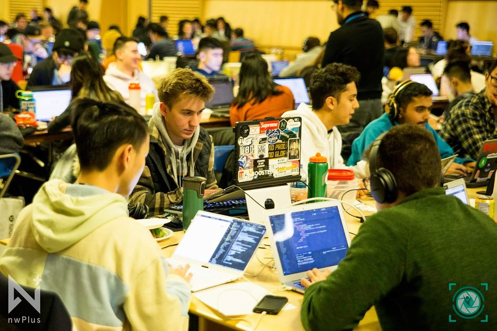
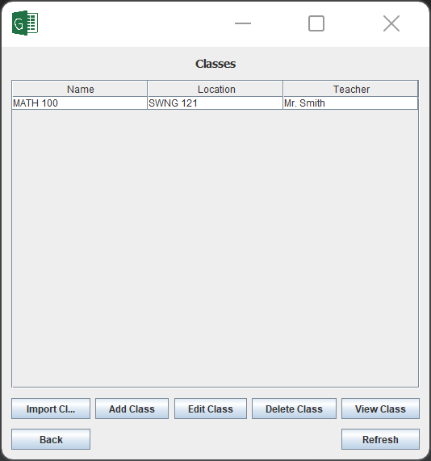
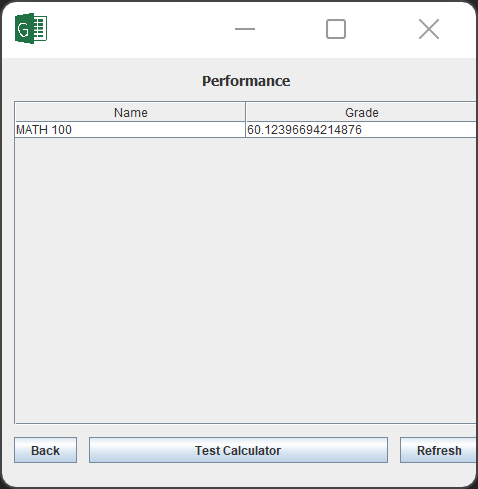

Last weekend, I participated in my first ever hackathon. HackED 2019 is put on by the Computer Engineering Club at the University of Alberta, and follows a similar format to most hackathons. First, there was an opening ceremony to introduce various sponsors, prizes, and relevant information to the competition. Then, we were released into the wild for twenty-four straight hours to produce a piece of software that did a cool thing. And finally, after all was said and done, us bleary-eyed programmers faced the judges and showed off our product.

_Michael from the future here! We created this very vintage Java application for tracking student grades. If you're bored, feel free to poke around the repository [here](https://github.com/michaelfromyeg/student-gradebook). It was my first interaction with Java, Swing, and OOP on a sizeable project._

So that's the gist: 24 hours, code something cool, try to win. Let's cut to the chase: why should you do it?

First reason: to learn. Hackathons are a great place to get started with programming. This was a bit of a surprise to me—many people at a hackathon go out of their way to learn a new technology with their project. At HackED 2019, my friends and I built something in Java, and we were all somewhat familiar. However, most decide to branch out and spend the twenty-four hours learning as much as they code. And it works. Because odds are, at a hacking conference with many, many hackers, someone else is probably already familiar with what you're struggling with. So one call-for-help and bam, the support is there. There is no better place to jump into a new programming language than a hackathon.

Second reason: to collaborate. Especially as a high school student, we don't often have to code together. We write projects, submit them to our instructor, rinse and repeat. When you work at a hackathon, you have to collaborate on code with your peers. For students of code who are new to this, using Git can having interesting results. Thankfully, at HackED there was a Git workshop so it wasn't a total bust. But having to do it first-hand with your friends is the best way to learn, plain and simple. And if you plan to work on any open source projects, it's a need-to-know skill.

Third reason: to network. There are so many bright, eager minds at these events with people interested in everything from Raspberry Pi to Flask to R, etc. You can learn so much just by striking up a simple conversation. At HackED, I learned a ton about post-secondary options, job options for computer scientists in Edmonton, and more. Hackathons are a great way to meet other folks in the industry.

All in all, go to a hackathon! You won't regret it. Your programming skills will thank you later.

As a bonus, here are a couple screenshots of what we built at HackED 2019.

