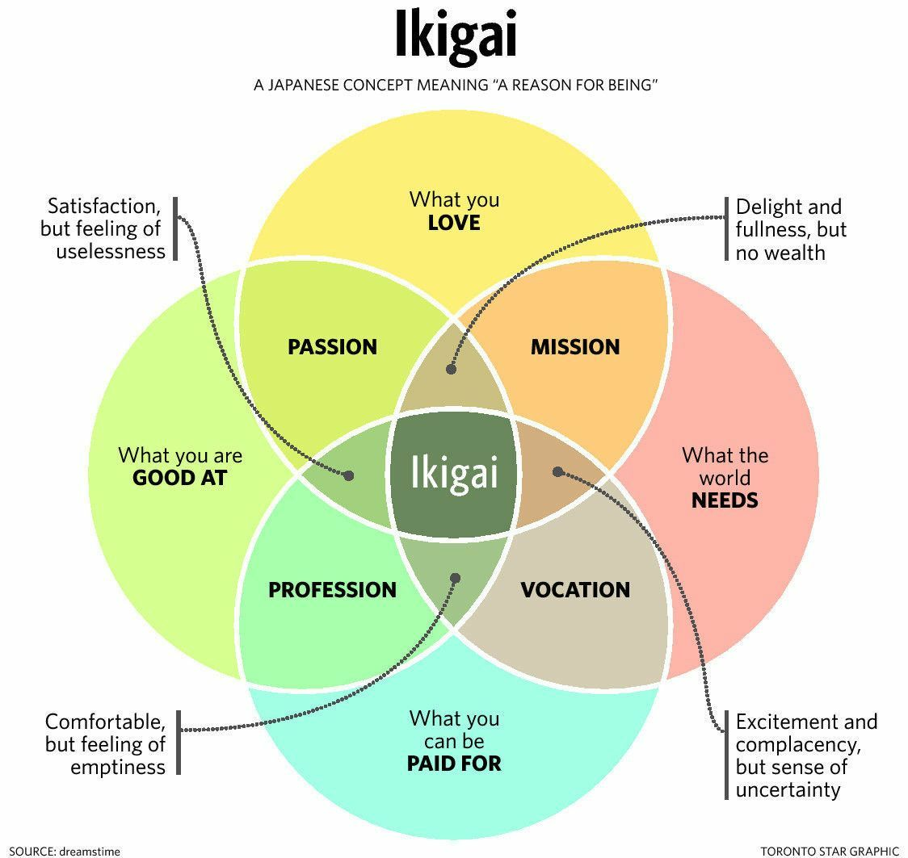

Some of my readers may know that I recently decided what I'll be doing past high school: studying computer science. This is very exciting as I now feel much more focused and fulfilled. I do find now that it is strange sitting in English classes and the like and trying to stay as motivated as I was. I now know that this subject won't be consequential to my life. However, I still enjoy all of my classes and have loved my school year so far.

Something I want to touch on in this piece is how I came to that decision. It's a very muggy thing, trying to decide what you're going to do after high school, and there's mounds of questionable advice out there. "Follow your passion!" is one quip I hear a lot. This is terrible advice. Your passion alone should not inform what you do, because it might not make sense with a few others things: what you're good at, what the world actually needs, and what you can make money for.

I did a little research, and stumbled across the Japanese concept of ikigai. Of course, I won't explain it perfectly, so I encourage you to check this out on your own, but I'll try my best. Ikigai is a Japanese term for "a reason for being," similar to ‘raison d'etre' and other expressions. In the culture of Okinawa, ikigai is thought of as "a reason to get up in the morning." Seems pretty cool right? So what does it actually look like? Well, I'll start with this venn diagram:

A four way venn diagram, so maybe not totally clear. Let's try to understanding what's going on. There are four categories, as mentioned. What you love, what you can be paid for, what the world needs, and what you're good at. Each of these intersect to fill different roles in our life: profession, vocation (a side hustle or a "calling"), mission, and passion. Now it's clear how passion alone is dangerous: it doesn't factor in money or the world at large. At the center of all of these concepts is harmony: ikigai. There are also cautions surrounding the venn diagram. Let's dissect them.

Without having what the world needs, we feel "satisfaction, but a feeling of uselessness." In our lives, we need to contribute to something greater, and to feel a higher purpose (regardless of our spirituality). Across from that is where we lack any money behind our work; we have "delight and fullness, but no wealth." Don't get too caught up in money though, there's a minimum you have to maintain to lead a satisfying life, and beyond that money begins to dictate your personality. What that baseline is varies from person-to-person, but try to determine what life you want to lead, and this can inform your salary goals. On the bottom right it reads, "excitement and complacency, but sense of uncertainty." In this example, we haven't taken advantage of our skills. This would create a similar apathy and sadness, as we feel we could achieve something greater. Lastly, to the left from there, it reads: "comfortable, but a feeling of emptiness." We need to have work that we love, otherwise, we dive deep into our work. Your life's achievements need to have a personal element to them to bring you joy!

So, there you have it: ikigai. A tangible way to think about what you want to do with your life. There are no wrong answers with ikigai, and if you ever feel you are missing something, you're never at a dead end. There are always chances to pick up a new hobby, work with a new organization, or challenge yourself somehow.

Oh, and how did I use ikigai to decide my major? I focussed on the intersection between what I was good at, and what I could be paid for. The world needs a lot of things, and there are lots of bright people working towards those things in their careers, so I didn't want that to necessarily inform my major. I'll put a pause on world domination for now. Moreover, I'm the type that loves virtually all of my work, so I didn't find that helpful in deciding. So, I had narrowed it down to what made money. Countless jobs have a salary I would be more than happy with. Some that stuck out included work in academia, STEM-centered jobs, potentially even law. Then I thought about what I was good at. I'm pretty flexible, but at more core I have a few main talents: math, problem-solving, and communicating. Well, a job that fuses that quite well is in computer science, where problems must be solved and presented to consumers!

If you have any questions about ikigai, you're always welcome to reach out at me@michaeldemar.co. I also encourage you to check out [this](http://forastateofhappiness.com/ikigai-the-happiness-of-always-being-busy-in-japan/) article.
