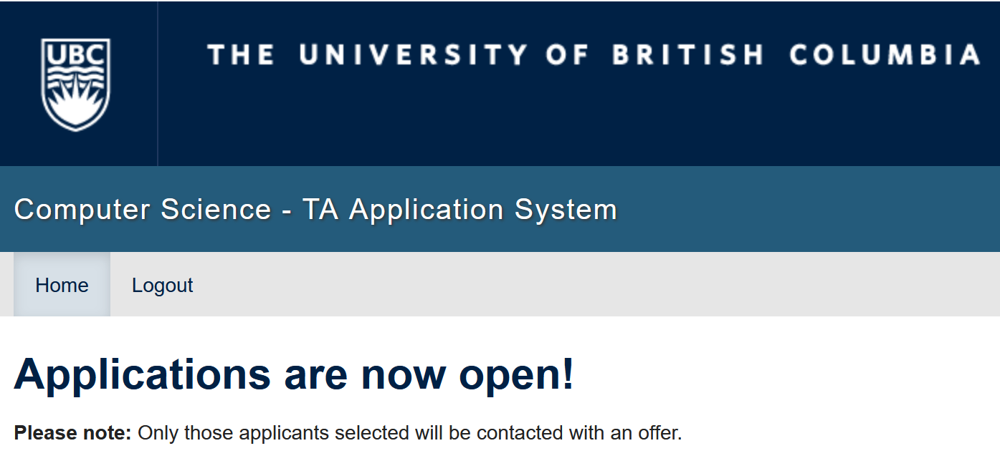

"Those who can do, those who can't teach."

That was a quip I'd make as a bratty thirteen year-old to my oldest sister while she was pursuing her BEd. at the University of Alberta.

Fast forward eight years, and I couldn't disagree more with that statement. Teaching has taught me so much about learning.

From the perspective of your TA, here's what I've learned about learning.

## Practice like your play

- Allen Iverson, we talking about practice?!
- "Muscle memory" is very real, and sometimes you're learning even when you don't realize it
- (Slapping water out of the bowl analogy)
- Treat exams as a sort-of game; keep a healthy relationship with your grades
  - (Somewhere half-way between ambivalence and fatalism)
- The moral? "Studying" is practice.

## Ask more questions

- I hate asking questions; I hate asking for help
- You have to do it to figure out what you don't know
  - (Four stages of competence; you don't know what you don't know)
- The moral? Push the content to its limit; always ask.

## "Debugging by TA"

- Don't cheat yourself; use your TAs for interesting questions, not to debug your code
- The moral? Be intentional about how you use your teachers (for good, not evil).

## To make it stick, teach

- University teaches you less than you think
- I forget what I learn uncomfortably quickly; forget 'cramming,' a regular semester is crammed
- Teaching the material is one of the best ways to really make it make sense
- The moral? Study in groups.

## Bonus: becoming a TA at UBC

Working as a teaching assistant is the best part-time job you can have as an undergraduate. So how do you become one? (I often get asked about how to become a TA at UBC, so I figured it's time to put pen to paper and write down my general thoughts.)

Firstly, let's deal with the _how_. Many departments have Undergraudate Teaching Assistants (UTAs). CPSC, MATH, STAT, and APSC (generally) hire the most. In CPSC, it's a centralized process. You go to [this](https://cs.ubc.ca/ta) URL, apply with your basic details, and then will be emailed if accepted. There is no interivew. For Winter term 1, applications are typically due in mid-June, and for term 2, around mid-October to early November.

Now, how do you get hired? Apply. Apply, _even as a first-year._ Apply for every course you possibly can. And say you're interested in them (i.e., put a 5!). To have a chance, you have to apply. The most important thing is getting hired the _first_ time; returning TAs get (significant) preference. After you've applied, consider gaining some teaching experience outside of TAing. You could try tutoring (such as through [the CSSS](https://ubccsss.org/services/tutor)) or on your own. You can also try creating content or techincal blog posts. Consider [this](https://youtube.com/watch?v=3fGpE_qR8-Y) CPSC 213 lab or [this](https://makefiles.michaeldemar.co) guide to `make`files as examples.

And what do you get? A flexible, on-campus job that pays well (~$23 hourly) that's relevant to your degree. Not bad, right?

Have questions about TAing? Reach out at mdemar01 \[at\] student \[dot\] ubc \[dot\] ca.

If there's interest, I can put together my thoughts on how to be a _great_ TA, too.
