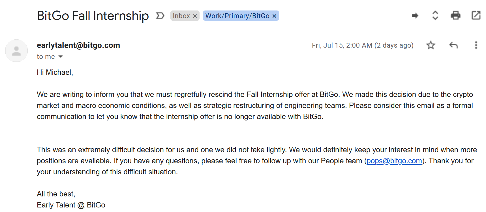
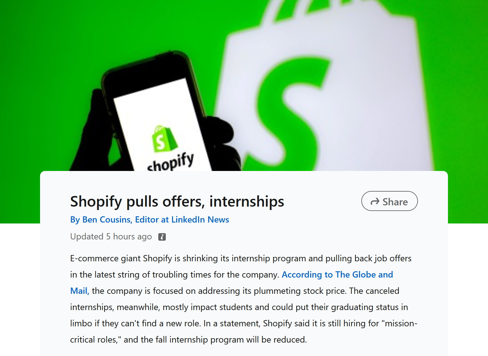
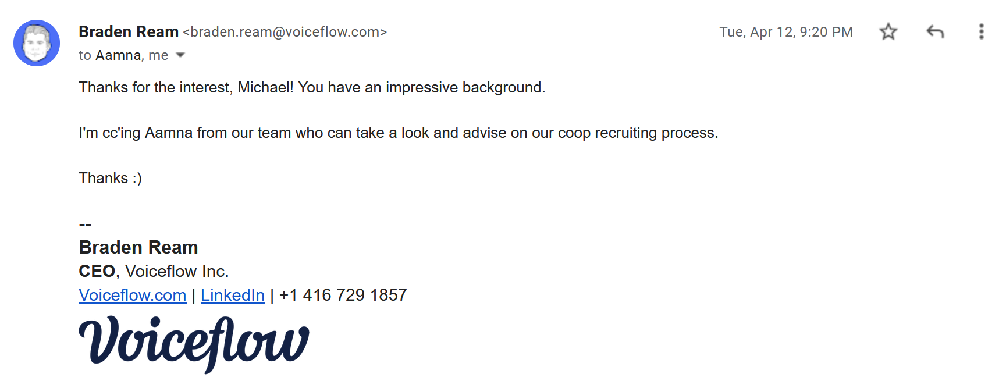
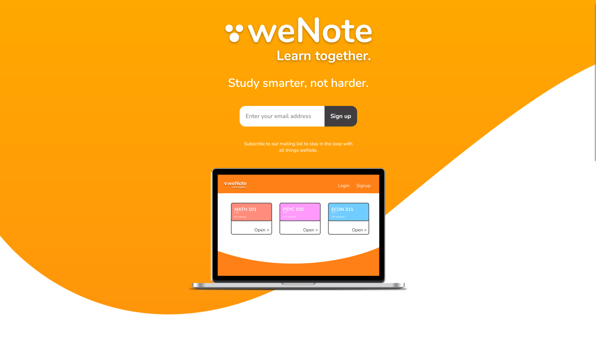

This upcoming fall, I was set on making a number of fairly major life changes. Firstly, I was headed to move from one of the world's largest technology companies to a cryptocurrency start-up. Secondly, I was going to pack my bags and move from Canada to Palo Alto, California. And thirdly, I was going to do it all basically on my own.

As of Thursday, I've been thrown back to square zero. Due to pressures in the cryptocurrency space, coined (pun-intended) a "crypto winter" (though frankly it seems pretty sunny in Toronto these days...), my offer at [BitGo](https://bitgo.com) was rescinded.

To be totally candid, I had kind of seen this coming. There were a number of major shake-ups with the early talent team that had recruited me in the first place, and I'd already seen the likes of Coinbase and Shopify pull similar moves. It's an unfortunate reality of working in an emerging industry, and I was aware of the risk in accepting the role. I'm still as passionate as ever about the potential of web3, and I know it won't be long until I'm back.

I'm keeping my chin-up and have my focus fixed firmly on getting back to square one. In this post, I want to share my "game plan" for how I'm going to strive to achieve just that. It's essentially the advice I would give myself if I could go back two years and coach my freshman-self through a first round of internship applications. Hope you enjoy.

## 1. Use your network

This piece is especially important when you're just getting started with recruiting in tech, or when you've faced a bit of a setback. To use a cliché, "your network is your net worth!" I find computer science doesn't have the same culture around recruiting, coffee chats, etc., as other industries, but it can truly accelerate your career.

Use social media to be open about projects you're working on and roles you're looking for. Keep your profiles up-to-date and try to stay somewhat active throughout the year. I think everyone feels a bit of anxiety around posting on LinkedIn, but that's easily one of the most effective channels. I've had 25,000+ impressions on my latest post. "Tech Twitter" is also a great place to stay active; I often fine early-stage founders recruit directly from the site. Relying on visible, open job applications like Indeed or LinkedIn is merely the tip of iceberg of what's out there!

(Another more "bold" strategy is becoming a content creator YouTube. I've met a ton of cool people after posting [this](https://www.youtube.com/watch?v=9FP8esDPPKY) video on advice for getting into the computer science major at UBC. To this day, I continue to get emails and DMs from students all across the globe!)

Also, go to stuff! I love using apps like Eventbrite and Meetup to see what's happening in my area. Attending events is bar-none the best way to meet people; networking "online" is not nearly as effective as just bumping into strangers at a conference. Try to step out of your comfort zone and put yourself out there. You'd be surprised what can turn up!

## 2. Don't be shy

When it comes to recruiting, you simply cannot afford to be shy. It's akin to that hackneyed quote, "shoot for the moon, and you're destined to land in the stars." Any ounce of impostor syndrome will hold you back from sending that one key cold email, or submitting an application to that one key role. After all, given the sheer size and rapid growth of the technology industry, it has been and continues to be a "numbers game." Finding a job you love takes a fair amount of dedication, and obliges casting a wide net.

I want to add a caveat here as well. This piece of advice I did not follow _at all_ last summer, and I got extremely lucky to end up at Amazon. I applied to a minimal set of jobs, and instead was bailed out by Greylock and a few "LeetCode easy's." Amazon is a fantastic company, and I am extremely fortunate to be where I am, but without casting a wide net, you'll be left with a lingering "what if?" Always try to aim higher; contentment will limit you!

A good way to apply this right away is to cold email your dream companies. For example, I've always wanted to work in the NLP space, and a dream company of mine is [Voiceflow](https://voiceflow.com). I sent a brief, direct email to the founder, and I heard back! While it didn't lead to a job, I came pretty darn close to a dream role. All from email!

This time around, I am working diligently and systematically to exhaust all possible avenues. Persistence pays dividends in the long run.

## 3. Gratitude in all things

In relying on your network's support and applying just about... everywhere, you must lead with gratitude. It is vital to show thanks for those that support you along every step of the journey. I would not be at my current university or in my current job if it weren't for the support of my family, a host of invaluable mentors, and a number of friends over the years encouraging me to keep pushing. It's essential to take time to show thanks; it's the right thing to do!

That being said, it's often overlooked. In the hustle and bustle of trying to get a job, it is easy to forget the follow-up thanks. Leading with gratitude is key.

Here's an easy way to apply gratitude right away. _Always_ follow up after chats and interviews. Sending a thank-you email is a must-do in my book, and can help you stand out. You can try kick-starting relationships with past mentors as well. It is never too late to rekindle and say thanks.

## 4. Builders build

If I could only pick one rule to keep, it'd be this one. The beauty of computer science is that no one can stop you from building. Like really, no one. (OK... maybe like, the FBI. But that's about it.)

Left without a job, there are countless ways to upskill and get ready for the next round. My favorite is building out 'little apps' (though a fully-fledged start-up is great, too). Participating in hackathons is a great way to get this going. Ask your friends and family what kinds of problems there having, and make little hacks for them. Keep them accessible for others online, and do it [in public](https://swyx.io/learn-in-public). Another good trick for easy adoption is building products for other developers; some good examples are CLI tools and IDE extensions.

The best experience I had with this was in Summer 2020 participating in an ex-Uber engineer-led program called ["Summer of Shipping"](https://summerofshipping.com/). It was an awesome community to helped folks bounce back from a summer with a _ton_ of offers rescinded. I even worked at a start-up idea [weNote](https://wenote.ca) that I'm hoping to return to this upcoming year!

There's also tons of resources online where you can learn for free, if you need a break from purely creating.

Just remember: the beauty of software is that truly anyone where anywhere can get started today. So don't wait for a FAANG offer to get started; start building today.

## In parting

Those are the 4 rules that I'll be following while re-recruiting for the fall. Have any you would add? Feel free to give me a shout at [mdemar01@student.ubc.ca](mailto:mdemar01@student.ubc.ca). I'm always happy to chat.
