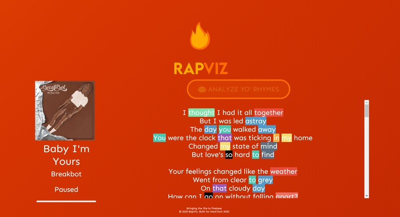
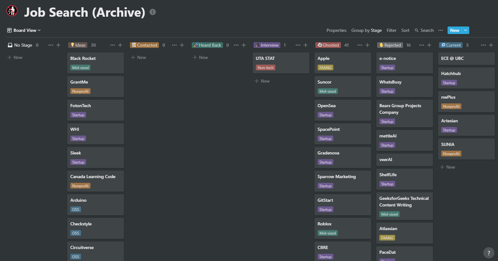
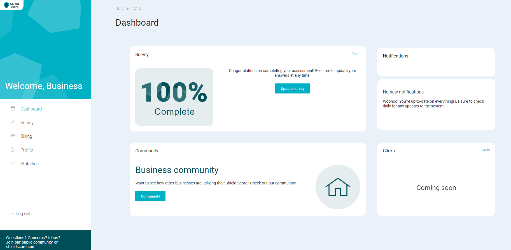

It's a Friday after classes. I'm grabbing a quick bite at one of UBC's only on-campus sit-down restaurants with a close friend, and a Gmail notification appears on my phone. As soon as I saw "UBC" in the subject line, I already knew what it was going to be.

Students had already been buzzing about it for the past week, and I even [tweeted](https://twitter.com/michaelfromyeg/status/1238500414053429248?ref_src=twsrc%5Etfw) about it. We were _finally_ going online.

> Classes are suspended at the UofA, UofT, McGill, Stanford, Western, UDub, Harvard, and UBC is still open... Pumped to go earn my 2% iClicker participation marks today.
>
> —Michael DeMarco (@michaelfromyeg) [March 13, 2020](https://twitter.com/michaelfromyeg/status/1238500414053429248?ref_src=twsrc%5Etfw)

Trailing behind the universities I mentioned in my Tweet, all of our classes were going remote starting the following Monday. Even though I had seen it coming, I was still a bit shell shocked. I think everyone had their "COVID-19 moment", where it stopped being a headline you read about in the news, and started dictating your way of life. Mine came in a 3-part saga.

First, it was [Hacktech](https://hacktech.io). Over Christmas break, a friend shared that Caltech's hackathon had opened their applications for 2020, and I thought it'd be a neat opportunity. I poured over my application, and with a bit of good fortune, got accepted. I booked my ticket to Pasadena and could hardly contain my excitement. Then, it moved online. Four-hundred dollars down the drain, I was a bit disappointed, but I got some friends together from UBC and ended up actually submitting a [project](https://rapviz.appspot.com) and earning a finalist distinction. This was a solid silver-lining; my fingers are crossed that I may take part in the event next year.

_More on RapViz: the source code for the project is available [here](https://github.com/michaelfromyeg/rapviz). My teammates and I used Flask, React, and the Genius API to put this together. It definitely needs a touch-up, but the code is most of the way there. It also needs to be refactored, splitting apart the API code from the front-end._

Second, it was, as I mentioned, school. Classes being online turned campus into a ghost town almost overnight. First-years flooded out of residents, clubs scrambled to pivot scheduled events online, and I clung on for dear life in each of my classes, submerged in school work. Within a few weeks, I managed to find a somewhat free weekend, pack my life away into four plastic boxes, and drive back to Edmonton. Over that weekend, I got an email from a software developer at the Government of Canada letting my know the internship I had just interviewed for was being eliminated. It was a bad week, to say the least.

Third, it was [SUNIA](https://sunia.ca). SUNIA is this week-long summer program I've worked with for nearly three years now. I started off in a generic programming coordinator role, helping make UN-related educational material; in my second year, I led marketing and did a fair amount of graphic design, while also working as our "CTO" (I snicker at the title, too); this year, I was working as the staff registrar, and also doing a bit more technology related work. [SUNIA got cancelled.](https://sunia.ca/covid) Again, like my semester moving online, I had seen this coming, but still, it meant my fears about a fully indoors summer and an online fall semester were validated.

I was defeated, but I still wanted to make something of my summer. Being so late in the recruiting year, my outlook was fairly bleak. [Here's](https://notion.so/michaelfromyeg/49058c86c8d44605b65f9637d8f9e8a7?v=3acd8e103476491f833c4d69a39995df) the Notion page where I tracked my applications. Nothing too exciting of note; I had to apply to a ton of start-ups, some unpaid internships, and a lot of, erm, _interesting_ positions, to say the least.

Then, I thrice got lucky. The first stroke of luck came in the form of an offer to TA an introductory computer science class. I had TA'd during the second semester of my first-year, and leveraging that, I nabbed a TA position for the first summer term. Being only a 10-hour per week role, I still wanted to do a little more. But, it was a definite start.

I also was able to leverage LinkedIn and find a part-time position with my school's Electrical and Computer Engineering (ECE) Department. If I'm honest, I think posting on LinkedIn is mostly a waste of time. There's just too much clutter on the platform; your time would be better spent working in public on GitHub, and tweeting your progress. But again, somehow a post of mine reached a communications lead working with ECE who thought I'd be a good fit for a position they'd just opened. ECE wanted to launch a new website they were working on, but needed help seeing it across the finish line. Their [old website](https://ece.ubc.ca), built using Drupal, was getting near-impossible to maintain, and they had already made a dent in a new WordPress site. With ECE, I've written a [few](https://ece.ubc.ca/news/202005/ece-capstone-faculty-award-recipients) [blog](https://ece.ubc.ca/news/202006/ece-phd-candidate-awarded-prestigious-microsoft-research-grant) [posts](https://ece.ubc.ca/news/202007/ubc-masc-student-developing-wearable-device-track-heart-and-brain-signals) about research ECE grads are doing, wrote a lot of HTML, CSS, and a bit of PHP for the new WordPress site, maintained some legacy code on Drupal, and done a bit of marketing work. It's been a cool gig. I also wrote a few projects to help me automate tasks at work. [Here's](https://github.com/michaelfromyeg/pylink) one, which interprets HTTP status codes into a "report", given a list of URLs, and [here's](https://github.com/michaelfromyeg/rECEsearch) another, which collects UBC ECE research and formats it in a way which can be uploaded to WordPress.

Finally, there was a _third_ stroke of luck I would never have seen coming. For the past few months, I'd been doing _ish_ contract work with a IoT company called [Artesian Software](https://artesiansoft.com). I say _ish_ because though I was on board as a developer, there was simply no work to be done. Then, thankfully, around about mid-May, the company signed a contract, and we were off to the races. We've been building a platform to support businesses communicate with customers post-COVID. You can see my handiwork [here](https://shieldscore.com). I get to work on a modern tech stack, which is a nice change of pace from Drupal: React (and React Native at one point), Node, SCSS, AWS (RDS with PostgreSQL, Dynamo, Cognito), ESLint, Stylelint, Prettier, and more. I've worked with the Stripe API, created my first microservice, learned a ton about REST, and even more about React.

Wanting to write a bit more code, I also joined an online community for hackers looking to replicate the in-person intern experience called [Summer of Shipping](https://summerofshipping.com), and joined a pre-seed accelerator [program](https://studentstartuplife.com/programs/student-summer-program) from Startup Edmonton, where I've been building [weNote](https://wenote.ca). I've also participated in a couple of hackathons; at one I wrote [a VS Code extension](https://marketplace.visualstudio.com/items?itemName=michaelfromyeg.vscode-puzzle) to help you practice interview-style coding problems in your editor, which won me the "best use of an external API award." (Even though I wrote my own API and did some, erm, questionable scraping. Whoops.) It currently has 14 installs, which is pretty cool!

_Quick update for 2022: it now has 127+ installs and 10+ stars on [GitHub](https://github.com/michaelfromyeg/vscode-puzzles)! Development is still actively continuing; my next planned feature is to support puzzles from Advent of Code._

Looking forward to the fall semester, I'm definitely nervous. Online school is hard. There's no getting around that fact. I'll be moving back to Vancouver, so hopefully cutting down the distance and being at least in the vicinity of campus should help my productivity. I'll also gain a bit of a community to rely on.

Beyond the fall, I also have to hunt down co-op positions for winter and summer 2021. The COVID and post-COVID job market is assuredly a "buyer's market," meaning that employers now have the pick of the litter when it comes to applicants. It's a scary reality, but it's one that's not going away anytime soon. My plan, for now at least, is to keep building projects, keep learning, keep being curious, and to stay vigilant. I'm not going to bother betting on getting lucky with offers again; lightning never strikes twice in the same place.
