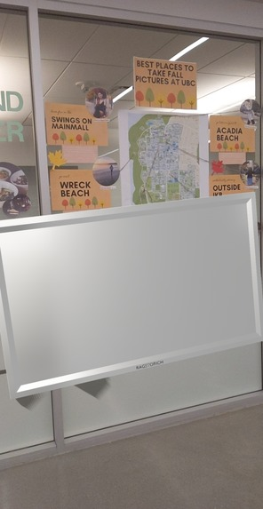
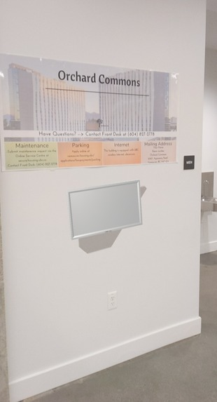
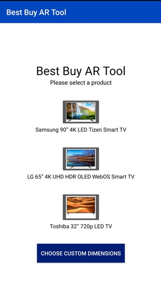

An AR Android application to let you view the latest Best Buy product in your home, from the comfort of your pyjamas.

### Background

This project was developed by Michael DeMarco and Liang Liu, and backed by a business model developed by Benji Li, Daniel Frydman, and Ophir Greif. It was built at BizHacks 2020, a business-oriented hackathon sponsored by Best Buy and hosted at UBC. My team and I developed a business solution for Best Buy, and took home the 2nd place prize out of over 50 teams.

### Usage

The project allowed users to determine what product dimensions were right for them from the comfort of their own home. Not sure if a 60" or 62" TV is right for you? Use our app to increment sizes of a mock TV displayed right on your wall, courtesy of the latest AR technology, or do a side-by-side comparison, or even enter a custom amount of inches!

Check it out below!

### How it's made

This project was built using Java and ARCore.

### Challenges

Getting the AR to work properly was quite tricky; we ran into a number of issues finding suitable 3D models.

### Accomplishments

The app works really nicely, and it took home 2nd place! It's an interesting, minimalist take on the idea of "visualize furniture in your living room" that Ikea made quite popular.

### Future

We should probably clean up the UI.
