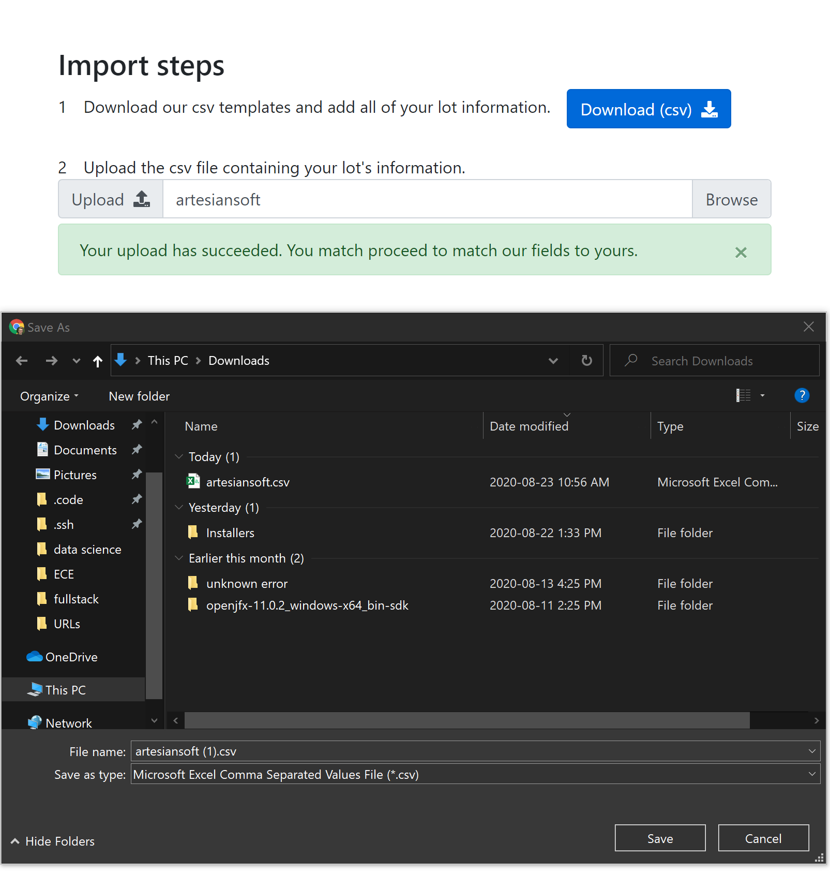
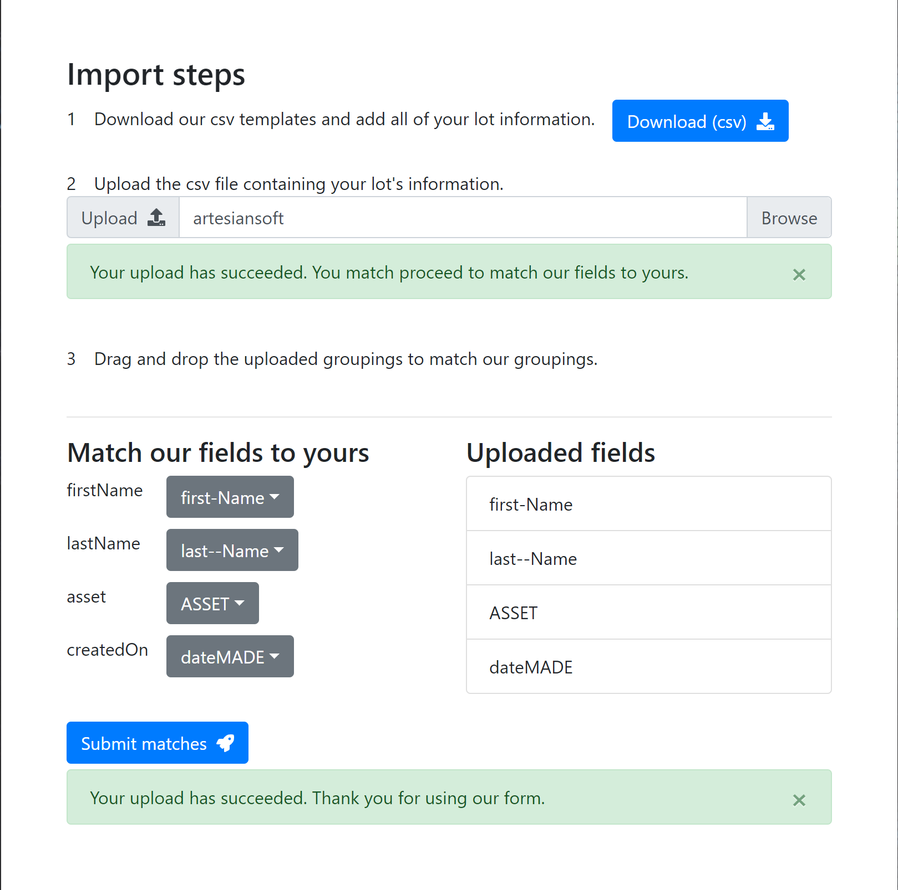
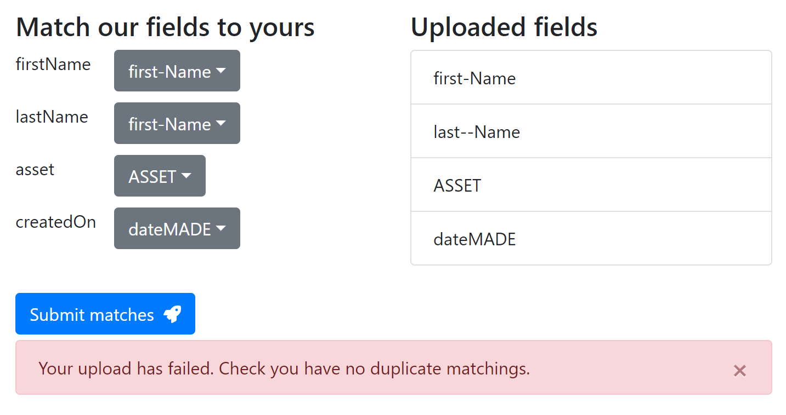

Upload and match CSV data. Simple, but practical! Check out the project for yourself, [here](https://michaelfromyeg.github.io/CSV-Upload-Tool).

### Background

This project was made for Artesian software, to be used in a more large scale project.

### Usage

A user can upload a CSV file with any data, and then can match their "headers" (the columns) to the one's anticipated by the app. With these pairings, the app then "reassigns" the user's data with the new headings and saves it to a SQLite database.

Check out some screenshots below!

### How it's made

The project was made using React, Flask, and SQLite. I used Bootstrap to style the components.

### Challenges

I struggled a decent amount to get SQLAlchemy to accept JSON data. Turns out they have a column type specifically for JSON. Consider this your friendly reminder to read the docs carefully!

### Accomplishments

I think the user experience is really smooth, and the app is visually quite appealing!

### Future

It'd be great to implement drag and drop.
