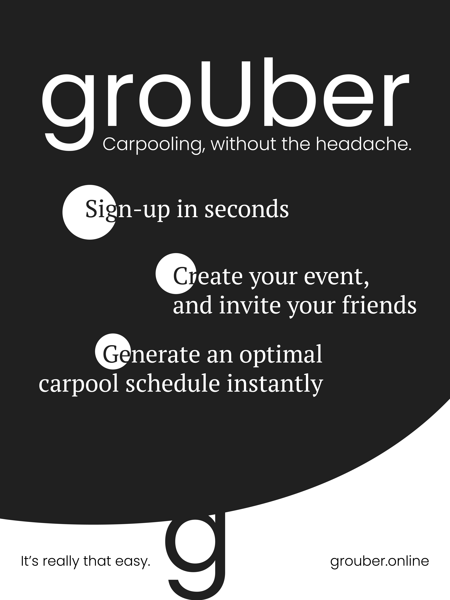
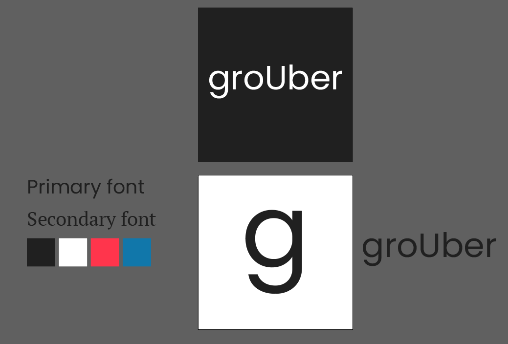
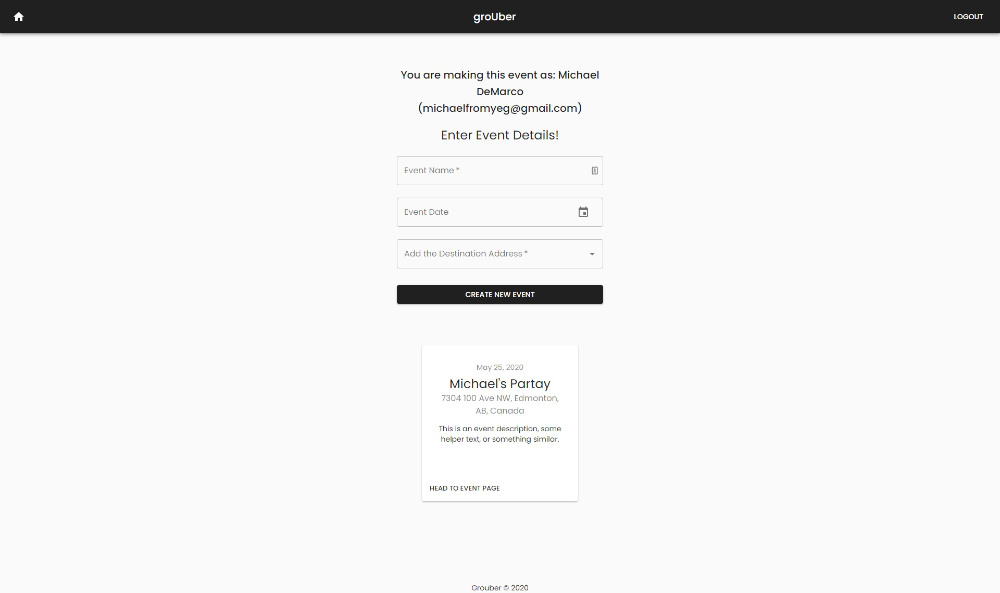
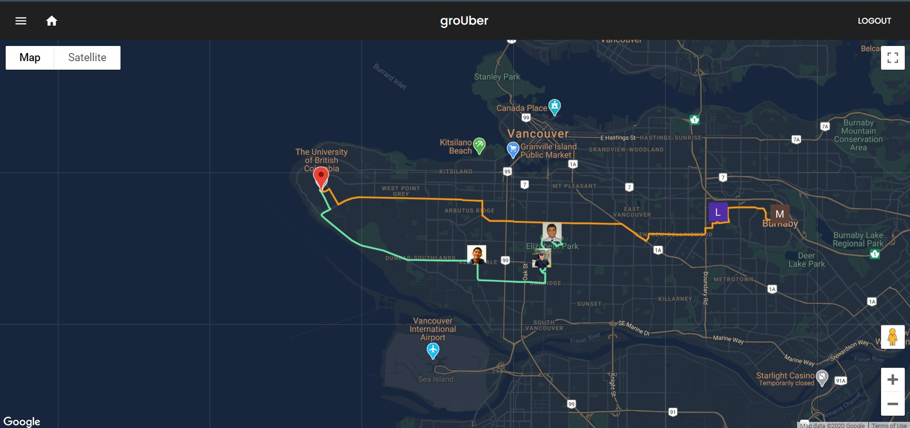
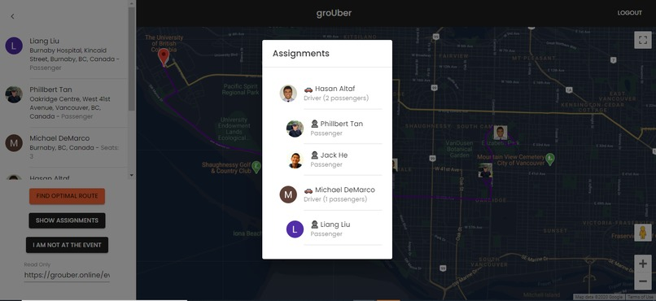
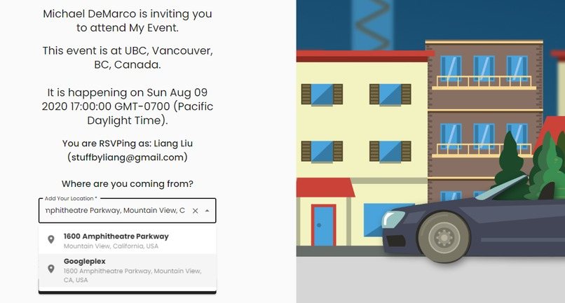

groups + Uber = groUber. Source code available [here](https://github.com/michaelfromyeg/groUber).

groUber is aimed to help event planners create carpools and was built for To the Moon and Hack, [an MLH event](https://mlh.io). (If you're going to use this project to plan your event, remember to stay 6ft apart!)

### Motivation

This project was built by a group of 5 students from UBC in Vancouver, BC who love automating things. And one horrific task all of us have run into when planning our events is creating a workable carpool schedule.

It's a great option for getting your group together: whether it be parents figuring out how best to get their kids to soccer practice, or friends accommodating those without access to a car, carpooling is common, but creating a plan can be painful, to say the least.

You finally come up with a workable schedule: everyone can make it to the event, no driver has to go in annoying, wasteful loops, and everything can start on time.

Then a driver with 4 seats drops out. And you have to do it all over again. No, thanks.

### Introducing: groUber

With groUber, never go through that headache again. As an event organizer, create your event, send an invite link to your friends, and create a carpool schedule with one click. As a participant, simply receive a link, RSVP, and inform the organizer of how many seats you have available. You'll receive a schedule on the day-of.

Using the Radar API and the Google Maps API, along with a bit of algo-magic, our app will create the most optimal carpool schedule for everyone involved. We were hesitant to do this project at first; the idea of designing an algorithm to find the "best" carpool strategy was intimidating to say the least. After some research, it turns out this is actually classified an NP-hard problem. We didn't need to solve the problem generally though, and were able to design a heuristic algorithm to be able to compute this with fairly good results. Here are a few examples of scholarly work in this area. It took great teamwork, persistence, and a decent amount of caffeine to get this working.

Now, drivers won't have to waste gas, and everyone will get there on time. Someone drops out? No problem, our app will allow you to adjust your schedule, painlessly.

groUber is ride-sharing for your group of friends, without all the expenses and overhead. Do a favor for the environment, and for your stress-levels, and start using groUber today.

Here's our [whitepaper](https://docs.google.com/document/d/e/2PACX-1vSLo8DhZ7p-VgPnmieasD01zZ2_76uMxPxSwVErq3_gQPvpokrFI4G5SHA1Pxrc9b9ouhK5yvL-4X3t/pub) where you can find a more in-depth justification for this hack! We also have a [slide deck](https://docs.google.com/presentation/d/e/2PACX-1vRY4A2dxP3vd1L7tY9gNC1Y0oegweKaiE9ZRHzulQArcLDld2zxErJQPk2TWvtwONXqdFWSECFlWEhh/pub?start=false&loop=false&delayms=15000&slide=id.p) for the visual learners out there.

### Stack

- TypeScript, React
- Node.js, npm
- Firebase, including authentication, hosting, and Firestore
- GitHub Actions

### Usage

Head to [grouber.online](https://grouber.online). Sign-up using your Google account.

Create your event with all key details, and send an invite to your to-be attendees. Once they RSVP, you'll see their details on your event dashboard. Then, generate your event's carpool schedule in one click!

Participants must submit their address, if they're driving, and if so, how many seats they have available in their vehicle.

Check out some screenshots of the application below!

### Contributing

Check out the GitHub repository for more information.
