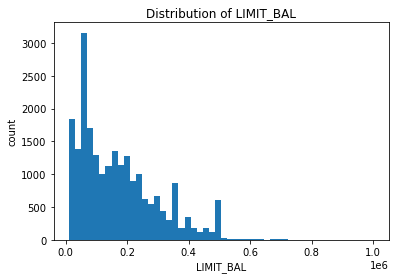
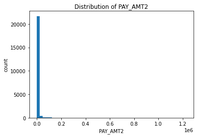
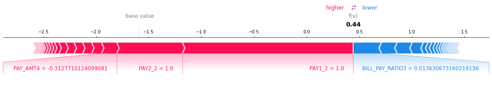

_The following blog post was written for the final homework submission of [CPSC 330, UBC's "Applied Machine Learning" course](https://github.com/ubc-cs/cpsc330). In the course, my partner Max and I got a hands-on introduction to machine learning with Python via sklearn._

## Problem

Defaulting on a credit card payment is a challenging situation for all those involved. The individual who defaulted is tasked with rebuilding their credit score, and the issuer is laden with the debt. Ideally, a financial institution could _predict_ whether or not someone will default ahead of time, and prevent it from happening in the first place.

While this is a daunting task—and one that requires sensitivity given the fact we are dealing with people's financial livelihoods—this is a situation where machine learning can be of use.

### Question

We'll apply machine learning techniques to answer the following question.

> Will this person default next month on their credit card payment?

With data relating to that person's demographics, payment history, and other financial information, we can attempt to predict the answer to this question.

### Data

The data set we used is publicly available on [Kaggle](https://kaggle.com/uciml/default-of-credit-card-clients-dataset). In contains demographic information such as sex, education, marriage and age; information regarding and individual's finances including limit balance, repayment status, bill amounts, and payment amounts. Finally, it contains whether or not that individual really _did_ default next month.

This is simply a high-level description of the data; for a more in-depth view, consult Kaggle or our [full report](hw6.pdf).

## Exploration

Before we delve into our analysis, let's get a better sense of the data available.

To begin with, we portioned off a chunk of our data, namely 25%, to eventually assess our model's effectiveness after our model is already created. Let's explore the remnants.

### Exploratory Data Analysis ("EDA")

We have 225,000 rows in our data available for training use, each representing an individual and their associated "features" (such as age or sex) as outlined above.

The "average" demographic in this data is someone who's single (instead of married), has a university-level education, and an age of about 35.

The individual with the highest limit balance is a 47 year old female with precisely NT$1,000,000 available, equivalent to roughly USD$100,000. This is definitely an outlier; the distribution for the rest of the balances is shown below. (Note dollar amounts are in New Taiwan dollars.)

We find most balances in the range of NT$50,000 (~USD$6,500) to NT$100,000 (~USD$13,000) which seems reasonable.

The repayment statuses in the month of August 2005 are, for whatever reason, highly skewed towards 0, which is the encoding of "use of revolving credit." A visualization of this is shown below.

It might be interesting to investigate any geopolitical events that occurred in the same time frame of this data set, the summer and fall of 2005, to account for any global financial trends.

With a better understanding of the data at hand, we proceed to our analysis.

## Analysis

Below is a description of our final model, and the results it yielded.

### Model

For our final model we opted to use [LightGBM](https://lightgbm.readthedocs.io/en/latest/index.html), which is a gradient boosted tree based model. Gradient boosted models are ensembles of weaker prediction models, in our case, decision trees.

LightGBM greatly outperformed the Decision Tree model. It also consistently outperformed the Random Forest model, even after we performed feature selection using `RFECV` and hyperparameter optimization using random search.

### Results

The LightGBM model achieved an accuracy of 0.82, F1-score of 0.48, and recall of 0.38. This means that from our test data, we would correctly predict whether or not someone would default about 82% of the time. Among all of the examples of "did default," we're correct only 38% of the time (—given the imbalance in the data set, this is somewhat to be expected). These results are promising, and should generalize well on "deployment data" since the test and validation scores are similar.

It's also interesting to look at how important our features were in the LightGBM model. SHAP force plots are one way of achieving this; without diving into depth here, just know that "red" means "did not default," and a bigger arrow implies more impact.

In the two plots above, we see that PAY1 played a major role. Perhaps this is because if an individual gets off on the wrong foot, they are unlikely to ever recover. Banks might be incentivized to try to get on top of late payments immediately, to prevent financial hardships from spiraling into an eventual default!

## Reflection

While we are satisfied with our results, there are some caveats that should be made known before anyone attempts to use this model on "real world" use-cases.

Firstly, the given data suffers from class imbalance. Most of our examples were of type "did not default," at a ratio of nearly 3-to-1. The imbalance in our data was naturally occurring, so we asked ourselves what kind of error we were trying to minimize. We were concerned with minimizing false negatives, and so we chose to focus on recall as our evaluation metric. Sometimes naturally occurring class imbalance is okay to ignore. However, we believe that a possible improvement of our modeling could be to undersample or oversample the data to attempt to further address class imbalance.

Secondly, the data available here was highly localized. All of our examples were from Taiwan, and so it is likely that our modeling would not generalize well to anywhere else in the world. Applying this model as a US Bank, for example, would be inappropriate as different cultures may exhibit different financial habits.

Finally, there may have been overfitting on the hyperparameters. The final model described here was not our only attempt at this problem; rather, it was just our best attempt. Since we re-tested with various models and ran our hyperparameter tuning more than once it is _possible_ that we unintentionally overfit our model.

## Conclusion

From our data set, we were able to produce a LightGBM model that showed promising results, with a recall score of 0.38. In the future, we could look to further tune our LightGBM attempt to improve on our performance!

Thanks for reading! Hope you enjoyed it.
