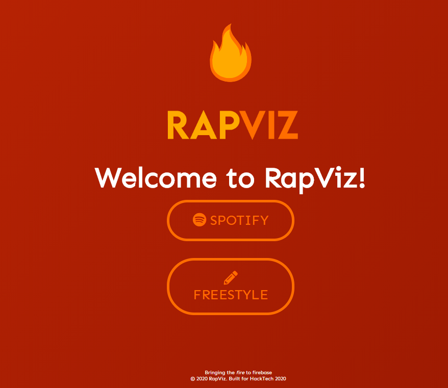

See your bars broken down right in the browser. Powered by Spotify, Genius, and Google Cloud. Check out the GitHub repository [here](https://github.com/michaelfromyeg)!

<!--  -->

### Background

There are loads of videos online that inspired this project. Take a look at Genius' version, [Check The Rhyme](https://www.youtube.com/watch?v=1VNHp_flJKE), or Vox's, [Rapping, deconstructed: The best rhymers of all time](https://www.youtube.com/watch?v=QWveXdj6oZU). These videos get millions, and I mean millions of hits online. Why? Well, it's fun! And it's cool. The basic concept is that rap lyrics are "broken down" and the rhyming groups are highlighted. Often the videos will do this on a syllable-by-syllable basis, but also sometimes do multi-word rhymes! For this project, we wanted to start simple and focus on single, whole word rhymes.

We thought we could leverage NLP, a couple of freely available APIs, and some basic React so create a website that generates these kinds of "highlighted" rhymes. So what happened?

### Usage

The user is presented with one of two options. They may either submit their own bars into a text field, or they can sign into Spotify and have their current song's lyrics analyzed. The lyrics are printed out with the rhyme scheme highlighted.

### How it's made

We used a Flask backend to write a couple of endpoints to help us LyricsGenius, an API for scraping lyrics from Genius. We also wrote our NLP-based rhyme detection algorithm in Python and processed all of that data on the backend. Spotify authentication and the UI was all handled by React. We eventually deployed our app to Google Cloud so other users could try it.

### Challenges

Developing the rhyme algorithm was really tricky, especially getting it to be fast enough (eventually down to O(n) time!). We also ran into issues integrating Spotify into our app, but eventually got it sorted.

### Accomplishments

We are able to programmatically generate what would take a video editor likely a couple of hours to do! Leveraging modern web technologies and NLP, displaying the rhyme scheme of a song proved to be a challenging but very possible feat.

### Future

Check out our [issues](https://github.com/michaelfromyeg/RapViz/issues) on GitHub! Though it was built at a hackathon (and there's quite a bit of spaghetti code) this is definitely a project I want to continue developing in the future.
